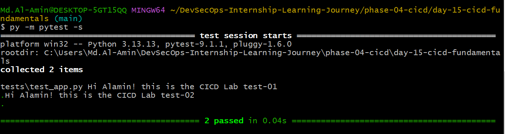
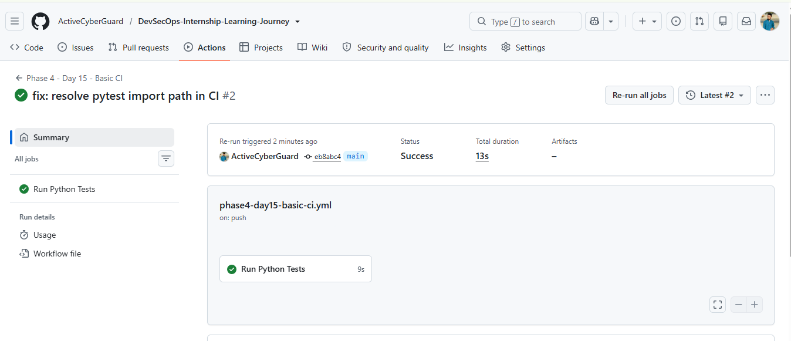

# Day 15 — CI/CD Fundamentals

## Objective

The objective of this lab was to understand the fundamentals
of Continuous Integration (CI) by creating a simple Python
application, writing automated tests using pytest, and
executing those tests automatically using GitHub Actions.

---

## Technologies Used

- Python
- pytest
- Git
- GitHub
- GitHub Actions

---

## Project Structure

```text
day-15-cicd-fundamentals/
│
├── app/
│   └── app.py
│
├── tests/
│   └── test_app.py
│
├── screenshots/
│   ├── 02-day15-local-test.png
│   └── 03-day15-github-actions-success.png
│
├── requirements.txt
└── README.md
```

---

## Application

The application contains two simple functions:

### Addition

```python
def add(a, b):
    return a + b
```

### Multiplication

```python
def multiply(a, b):
    return a * b
```

---

## Automated Tests

The application was tested using pytest.

Tests include:

- Addition test
- Multiplication test

Example:

```python
from app.app import add, multiply


def test_add():
    assert add(2, 3) == 5


def test_multiply():
    assert multiply(4, 5) == 20
```

---

## Local Testing

### Install Dependencies

On Windows:

```bash
py -m pip install -r requirements.txt
```

### Run Tests

```bash
py -m pytest -s
```

### Expected Result

```text
2 passed
```

---

## Continuous Integration

A GitHub Actions workflow was created to automatically run
the tests whenever relevant changes are pushed to the `main`
branch.

Workflow file:

```text
.github/workflows/phase4-day15-basic-ci.yml
```

---

## GitHub Actions Pipeline

The CI pipeline performs the following steps:

```text
Checkout Repository
        ↓
Setup Python 3.12
        ↓
Install Dependencies
        ↓
Run pytest
        ↓
Tests Passed
```

---

## CI Result

The GitHub Actions workflow completed successfully.

```text
✓ Checkout repository
✓ Setup Python
✓ Install dependencies
✓ Run tests

2 passed
```

---

## Screenshots

### Local Test



### GitHub Actions Success



---

## Learning Outcome

After completing this lab, I learned how to:

- Write basic automated tests using pytest
- Run Python tests locally
- Configure a GitHub Actions workflow
- Automate dependency installation
- Execute tests automatically in CI
- Identify and fix Python import path issues in CI
- Verify CI pipeline success through GitHub Actions